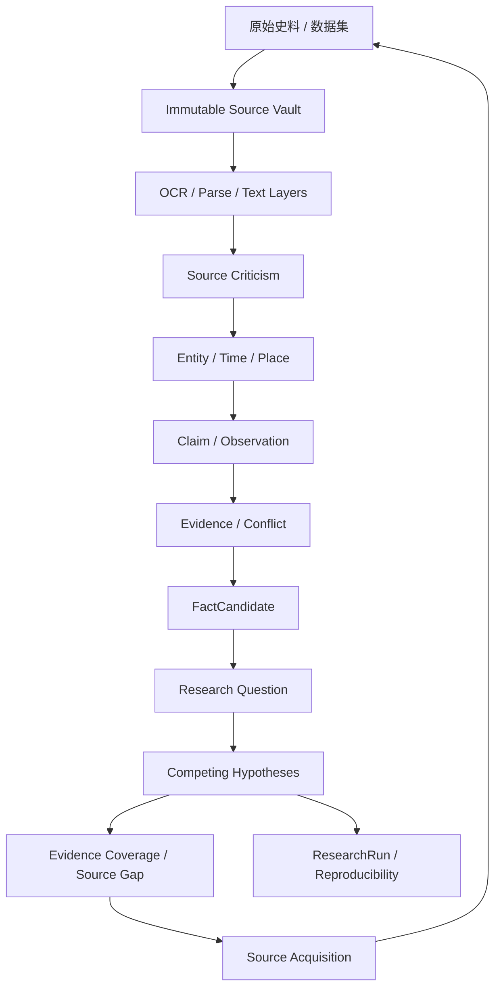
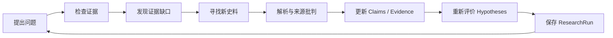

# 史鉴 Histora

> **Historical Causal Intelligence System · HCIS**  
> 面向历史研究的因果智能系统：从史料采集、证据分析，到假说检验与可复现研究的一体化平台。

Histora 不是一个简单的“历史知识库”，也不是把一批史料接给大模型之后直接做问答的历史版 ChatGPT。

它真正要解决的问题，是如何把数量庞大、来源复杂、彼此矛盾、时间跨度极长的历史资料，逐步转化为一套 **可追溯、可质疑、可比较、可重新计算、可用于因果研究的历史知识体系**。

它最终希望做到的事情可以概括为一句话：

> **让计算机不仅知道“历史上发生了什么”，还知道这些判断来自什么证据、证据是否独立、哪里存在争议、为什么会发生，以及当条件改变时，历史可能沿着什么边界演化。**

---

## 为什么要做 Histora

历史研究天然存在一个规模问题。

一个研究者可以精读几十本、几百本史料，但当研究对象扩展到实录、方志、奏疏、私人笔记、外国记录、地图、气候数据、人口数据、财政数据、考古材料以后，任何个人都很难长期记住所有来源之间的关系。

大语言模型提升了“阅读能力”，但并没有自动解决历史研究中的核心问题：

- 这句话是谁说的？
- 是当时记录，还是后世转述？
- 是亲历、传闻，还是推测？
- 多个来源是否互相抄录？
- 一个数字是行政登记值，还是实际人口？
- 一个日期是农历、年号纪年，还是现代公历？
- 新资料出现后，旧结论是否需要重新计算？
- 模型升级后，为什么答案变了？

因此 Histora 从一开始就采用：

> **Evidence First — 证据优先，而不是答案优先。**

---

# 核心认识论

Histora 的基础链路不是：

```text
史料 → AI → 答案
```

而是：



Histora 允许系统明确地说：

> “目前无法确定。”

而不是强行合并冲突资料，制造一个看起来确定的答案。

---

# Claim 与 Fact 永远分开

这是 HCIS 最重要的规则之一。

假设史料写道：

> “或云贼众十万。”

普通信息抽取系统可能直接得到：

```text
敌军人数 = 100000
```

Histora 不允许这样做。

它首先保存：

```text
Claim
├─ source
├─ source_location
├─ original_text
├─ text_layer
├─ epistemic_status = RUMORED
├─ confidence
└─ source_independence
```

只有经过来源批判、交叉验证、冲突分析以后，系统才可能进一步产生：

```text
FactCandidate
```

因此：

> **“某史料声称什么” 与 “历史上实际发生了什么” 是两个不同的数据对象。**

---

# 原始史料永久不可覆盖

任何进入 Histora 的原始资料首先进入 **Immutable Source Vault**。

系统保存：

- SHA-256
- 原始文件名
- 来源机构
- 下载时间
- 版本
- 版权 / Rights
- Persistent Identifier
- Source URL

随后才产生派生层：

```text
Original Image
↓
Transcription
↓
OCR
↓
Normalized Text
↓
Translation
↓
Modern-language Explanation
```

OCR 错误、繁简转换、翻译结果都不能覆盖原始材料。

---

# 历史文本与古籍校勘

Histora 的 Historical Text / Philology Engine 面向古籍中的真实问题：

- 异体字
- 古今字
- 通假字
- 避讳字
- 繁简差异
- 古籍无标点
- OCR 错字
- 数字误识
- 干支误识
- 人名异写
- 地名异写
- 版本异文

例如 OCR 如果把干支识别为：

```text
己已
```

系统可以根据历法规则提出：

```text
候选校正：己巳
confidence: 0.72
```

但原始 OCR 结果仍然保留。

更重要的是：

> **OCR 错误 ≠ Textual Variant。**

只有不同版本的原始文本真正存在差异时，才进入 Textual Variant 系统。

---

# Historical Calendar Engine

历史资料中的时间经常不是 `1644-04-25`，而是：

```text
崇祯十七年三月十九日
```

Histora 保存：

```text
original_expression
reign_title
reign_year
lunar_month
lunar_day
sexagenary_day
calendar_system
normalized_start
normalized_end
conversion_rule
confidence
```

原始历史日期永远不会被现代日期覆盖。

支持目标包括：

- 年号
- 农历
- 干支
- 闰月
- 儒略历
- 格里高利历
- “是冬”
- “旬日”
- “月初”
- 其他模糊历史日期

---

# Historical Metrology / Currency Engine

历史单位不能用现代固定换算表粗暴转换。

Histora 把：

- 石
- 斗
- 两
- 钱
- 亩
- 里
- 银
- 铜钱

都建模为带有时间、地点和制度条件的 HistoricalQuantity。

```text
OriginalQuantity
├─ value
├─ unit
├─ time
├─ place
├─ definition
├─ source
└─ uncertainty
        ↓
ConversionRule
        ↓
NormalizedEstimate
├─ min
├─ expected
├─ max
└─ confidence
```

银两与铜钱的兑换率本身就是历史变量，不能被设置成全局常数。

---

# 人物、地点与实体解析

Histora 自动处理：

- Person
- Place
- Office
- Institution
- Organization
- Technology
- Concept

历史人物可能同时拥有：

```text
姓名 / 字 / 号 / 官职称呼 / 封爵 / 外号 / 异体字 / 外文转写
```

因此系统使用：

```text
Entity
EntityMention
Alias
EntityCandidateMatcher
EntityResolution
```

并支持：

```text
MERGE → RELINK → RECALCULATE
SPLIT → REASSIGN → RECALCULATE
```

MERGE 不物理删除原 Entity；错误合并以后仍可以回溯和 SPLIT。

---

# Source Genealogy：10 本书不等于 10 个独立证据

如果：

```text
B 抄 A
C 引 B
D 又据 C
```

传统系统可能得到：

```text
4 个来源支持同一观点
```

Histora 会区分：

```text
raw_source_count = 4
independent_source_cluster_count = 1
```

SourceRelation 包括：

- CITES
- COPIES
- DERIVES_FROM
- TRANSLATES
- EDITS
- ABRIDGES
- REPRINTS
- POSSIBLY_DEPENDS_ON

证据数量与证据独立性必须同时显示。

---

# Source Criticism：把史料批判做进数据结构

每份史料都可以拥有 SourceCriticismProfile：

- 真伪
- 成书时间
- 作者身份
- 是否同时代
- 是否亲历
- 信息直接性
- 政治 / 制度立场
- 来源独立性
- 传播链
- 编辑历史
- 幸存偏差

“官方来源”不会自动等于事实。

它仍然必须经过：

```text
Source Criticism → Claim → Evidence → FactCandidate
```

---

# 结构化历史数据也是一等公民

CSV / XLSX 可以直接进入 Observation Pipeline。

适用于：

- 人口
- 粮价
- 财政
- 军费
- 气候
- 土地
- 贸易
- 白银流动

Observation 保存：

```text
value
unit
definition
time
place
group
source
coverage
uncertainty
observation_type
```

类型包括：

```text
DIRECT
PROXY
ADMINISTRATIVE
ESTIMATE
```

因此：

> 户籍人口 ≠ 实际人口  
> 树轮 proxy ≠ 精确天气记录

---

# Evidence Coverage：系统必须知道自己“不知道什么”

Histora 从以下维度计算证据覆盖：

- 时间
- 地点
- 社会阶层
- 性别
- 机构
- Source 类型
- Evidence Family
- 研究主题
- 独立来源数量
- 观察分辨率

例如：

```text
1638 陕西
官府财政资料      HIGH
军事资料          MEDIUM
基层农民生活      LOW
女性史料          VERY_LOW
```

低覆盖度会降低结论置信度，并可以自动产生：

```text
Coverage Gap → Source Gap → Source Acquisition
```

---

# Source Acquisition Engine

Histora 不是只处理用户手动导入的材料。

系统设计了面向官方机构的 Source Acquisition Engine，优先使用：

1. Official REST / JSON API
2. IIIF
3. OAI-PMH
4. SRU / SRW
5. SPARQL / Linked Data
6. Official Bulk Dataset
7. RSS / Sitemap
8. Permitted HTML Discovery

初始 Provider 架构包括：

- Library of Congress
- Smithsonian Open Access
- Europeana
- Bibliothèque nationale de France / Gallica
- National Palace Museum Open Data
- Academia Sinica Discovery

系统遵守 RightsDecision。

如果出现：

- 登录限制
- CAPTCHA
- Paywall
- Institution Subscription
- 未知版权
- 禁止自动下载

则进入：

```text
DISCOVERY_ONLY
```

而不是绕过访问控制。

---

# Research Question / Hypothesis

Histora 的高级研究对象不是“一条 Prompt”，而是 ResearchQuestion。

例如：

> 为什么崇祯时期明朝财政能力持续恶化？

系统允许建立彼此竞争的 Hypotheses：

```text
H1 白银输入变化
H2 军费持续增长
H3 税制效率下降
H4 灾害破坏税基
H5 地方行政能力下降
```

每个 Hypothesis 单独保存：

- Supporting Evidence
- Contradicting Evidence
- Missing Evidence
- Alternative Hypotheses
- Falsification Conditions
- Confidence

Source Acquisition 需要主动寻找支持、反对和独立证据，避免 confirmation-only research。

---

# Golden Corpus / Regression

Histora 不允许因为“新模型更先进”就自动替换旧模型。

Golden Corpus 用于持续测试：

- Entity Extraction
- Entity Resolution
- Historical Date
- Claim Extraction
- Hearsay Classification
- Source Genealogy
- Textual Variant
- Structured Observation
- Unit Conversion
- Place Resolution

模型、Parser、Prompt、Rule、Resolver 升级以后，都必须重新跑 Regression。

---

# ResearchRun：让研究结论可以复现

每一次重要研究可以保存为 ResearchRun：

```text
ResearchQuestion
Query
Source Snapshot
Evidence Set Hash
Claim Set Hash
Observation Set Hash
Model / Provider
Routing Policy
Prompt Version
Schema Version
Parser Version
Application Version
Generated At
```

两次 ResearchRun 可以比较，并回答：

> **为什么这个结论后来发生了变化？**

例如：

- 新增史料
- 发现原本认为独立的两份资料存在来源依赖
- 人物实体发生 SPLIT
- 某组人口数字从 DIRECT 改判为 ADMINISTRATIVE
- 模型或规则升级

---

# 长期目标：Historical World Model

Histora 的远期目标不止是知识管理。

未来对象包括：

```text
WorldState
InformationSet
Belief
Decision
CausalRelation
FeedbackLoop
Shock
Scenario
HistoricalMemory
```

系统会明确区分：

> 客观发生了什么

和：

> 当时行动者认为发生了什么。

历史人物应当根据他们当时能获得的信息行动，而不是根据后世已经知道的结果行动。

长期还计划支持 DAG、自然实验、DiD、Event Study、ITS 等因果识别工具，并区分：

```text
MECHANISTIC
STATISTICALLY_IDENTIFIED
HISTORICALLY_INFERRED
SPECULATIVE
```

反事实分析则必须满足 Minimal Intervention、约束条件和随时间扩大的不确定性，而不是变成架空小说生成器。

---

# 首个 Reference Era：晚明

首个实验时代：

> **Late Ming 1572–1644**

核心窗口：

> **崇祯时期 1627–1644**

初始重点史料包括：

- 《明季北略》
- 《国榷》
- 《崇祯长编》
- 《明神宗实录》
- 《明熹宗实录》
- 《大明会典》
- 《大明律》
- 《酌中志》
- 《万历野获编》

晚明同时存在财政、战争、气候、人口、技术、全球白银流动、信息失真和政治决策等问题，非常适合作为 HCIS 的第一批真实世界测试材料。

---

# 真实历史案例

> **说明：以下案例均来自真实史料或公开学术材料，用于说明 Histora 为什么需要这些数据结构。它们不是“当前 v2.0 已经自动处理完成”的演示结果。当前仓库仍处于 Code-Locked Bootstrap 阶段，后续会把这些案例逐步固化为真实 Corpus / Golden Regression Fixtures。**

## 案例 1：袁崇焕——“袁崇焕”和“袁元素”不是两个人

《明史》卷二百五十九开篇记载：

> “袁崇焕，字元素，东莞人。”

这意味着在历史文本里出现：

```text
袁崇焕
元素
袁元素
```

不能简单按字符串创建三个 Person。

Histora 应将原始 Mention 保留，同时通过 Alias / Entity Resolution 建立同一人物的身份关系：

```text
Entity: 袁崇焕
├─ canonical_label: 袁崇焕
├─ alias: 元素
└─ source evidence: 《明史》卷259
```

这也是为什么 HCIS 必须把：

```text
Entity ≠ EntityMention ≠ Alias
```

设计成不同对象。

**原始资料：**
- 《明史》卷259：https://zh.wikisource.org/wiki/明史/卷259

---

## 案例 2：崇祯十七年三月十九日——历史日期不能只存公历

《崇祯记闻录》记甲申北京之变时写道：

> “十九日……上仓猝无措，奔至煤山自缢。”

《爝火录》卷一则明确记：

> “甲申（一六四四）……三月己丑朔十九日（丁未）……”

现代学术文献通常把 **崇祯十七年三月十九日** 对应为 **1644 年 4 月 25 日**（Gregorian）。

Histora 不应只保存：

```text
1644-04-25
```

而应保存：

```text
original_expression = 崇祯十七年三月十九日
reign_title = 崇祯
reign_year = 17
lunar_month = 3
lunar_day = 19
sexagenary_day = 丁未
normalized_date = 1644-04-25
conversion_rule = ...
confidence = ...
```

这样既能进行现代 Timeline 对齐，又不会抹掉史料本身的时间表达。

**原始 / 学术资料：**
- 《崇祯记闻录》：https://zh.wikisource.org/zh-hans/崇祯記聞錄
- 《爝火录》卷一：https://zh.wikisource.org/wiki/爝火錄/卷一
- University of Washington Press, *Confucian Image Politics* 中明确使用 “Chongzhen 17/3/19 (April 25, 1644)”：https://uw.manifoldapp.org/system/resource/c/5/9/c594ef63-27b4-4d96-b963-db8dabdd8f07/attachment/279ec75ab8e444f87fad71bafa68f6b7.pdf

---

## 案例 3：明代“官方人口”不能直接当作“实际人口”

明代人口史是 Histora Observation Model 的典型案例。

明代官方户籍记录长期维持在约六千万人量级，但现代学界对 1600 年前后实际人口存在远高于官方数字的重建，同时各家估计差异也非常大。

例如学术研究中长期引用何炳棣（Ping-ti Ho）约 **1.5 亿** 的估计；另一些重建更高或更低。近年的研究仍然专门讨论为什么不能简单把明代官方人口登记直接当成实际人口。

因此下面两个对象在 Histora 中必须严格分开：

```text
Observation A
value = 明代官方登记人口
observation_type = ADMINISTRATIVE
```

和：

```text
Observation B
value = 学术重建人口估计
observation_type = ESTIMATE
method = demographic reconstruction
uncertainty = ...
```

系统不能因为一个数字来自《大明会典》之类的官方材料，就把它自动升级为“真实人口”。

这正是：

> **Observation ≠ Reality**

的现实案例。

**学术资料：**
- LSE Economic History Working Paper 158（表格汇总官方人口与 Ho / Perkins 等重建）：https://www.lse.ac.uk/Economic-History/Assets/Documents/WorkingPapers/Economic-History/2012/WP158.pdf
- Population Review 对明代官方人口与约 1.5 亿重建值的讨论：https://populationreview.com/files/716335pp20-77.pdf

---

## 案例 4：同一事件可以有多个来源，但“来源数量”不等于“独立证据数量”

甲申北京陷落以后，大量同时代、近同时代以及后出的史书都记录了崇祯帝之死、李自成入京以及随后的政局变化。

例如：

- 《崇祯记闻录》记录十九日北京失守和崇祯帝自缢；
- 《爝火录》卷一同样记录甲申三月十九日北京陷落；
- 后出的史书又会继续引用、整理、转述早期材料。

对于 Histora 来说，“找到 20 条类似叙述”并不能直接得到：

```text
independent_evidence = 20
```

系统还必须继续调查：

- 作者是否独立获取信息；
- 是否引用共同底本；
- 是否属于后世编辑和汇编；
- 文本之间是否有明显复制链；
- 哪些记录是同时代材料，哪些是后世重建。

因此 Source Genealogy 是证据聚合的前置条件，而不是可有可无的附加功能。

**注意：** 上述两部史料“都记录了这一事件”是可核验事实；README 并不预设它们之间存在直接抄录关系。具体依赖关系必须由 Source Genealogy 在证据支持下判断。

---

# 技术架构

## Desktop

- Tauri 2
- React
- TypeScript
- Vite

## Backend

- Python 3.12+
- FastAPI
- SQLAlchemy 2.x
- Pydantic v2
- Alembic

## Storage

- SQLite
- FTS5
- Immutable Source Vault
- Derived Graph / Cache

## AI / Document / Historical Computing

- Ollama
- OpenAI-compatible API
- MinerU
- PaddleOCR
- DeezyMatch
- T-Res
- MapReader
- NetworkX

核心原则：

> **业务逻辑依赖 Adapter Interface，而不是直接依赖第三方 SDK。**

---

# Model Control Center

Histora 不绑定单一模型。

不同任务可以使用不同模型：

- DOCUMENT_METADATA
- ENTITY_EXTRACTION
- ENTITY_RESOLUTION
- EVENT_EXTRACTION
- CLAIM_EXTRACTION
- SOURCE_CRITICISM
- VARIANT_ANALYSIS
- TABLE_SEMANTIC_MAPPING
- RESEARCH_SYNTHESIS

Routing Mode：

```text
FIXED
PREFERRED_WITH_FALLBACK
AUTO
```

Source Privacy：

```text
LOCAL_ONLY
LOCAL_PREFERRED
CLOUD_ALLOWED
```

`LOCAL_ONLY` 是硬约束。

如果没有可用本地模型，应返回：

```text
BLOCKED_PRIVACY_POLICY
```

而不是偷偷发送到云端。

---

# 当前阶段：Code-Locked Bootstrap v2.0

当前仓库已经从“架构说明”进入代码级约束阶段。

已经存在：

- FastAPI 后端骨架
- SQLAlchemy Core Models
- Alembic Migration
- Domain Contracts
- Adapter Contracts
- Repository Contracts
- Source Vault 基础代码
- Model Router
- Ollama Provider
- OpenAI-compatible Provider
- Job State Machine
- Storage 基础实现
- Source Acquisition Connector 框架
- React / Tauri UI 骨架
- Acceptance Tests
- Adversarial Tests
- Code Lock Verification

当前并不宣称所有 Histora 功能已经完成。

下一阶段是：

```text
Code-Locked Bootstrap
↓
具体 Adapter 实现
↓
真实古籍 / OCR / CSV-XLSX
↓
Cross-source Comparison
↓
Golden Regression
↓
ResearchRun
↓
AUDITOR ROLE
↓
RC0
```

---

# Code Lock

核心 Contract 已通过 `CODE_LOCK_MANIFEST.json` 进行 SHA-256 锁定。

Agent 不得自行删除、重命名或改变核心语义：

- `backend/hcis/domain/contracts.py`
- `backend/hcis/domain/models.py`
- `backend/hcis/adapters/contracts.py`
- `backend/hcis/model_control/contracts.py`
- `backend/hcis/acquisition/contracts.py`
- `backend/hcis/storage/contracts.py`
- `backend/hcis/core/enums.py`
- `backend/hcis/api/contracts.py`
- Acceptance Tests

验证：

```bash
python scripts/verify_code_lock.py
python scripts/verify_bootstrap.py
```

如果真实实现证明 Locked Contract 无法满足需求，必须先提交：

```text
CONTRACT_CHANGE_PROPOSAL.md
```

说明 blocker、migration、兼容性、测试和 rollback；不得因为实现困难静默重构核心架构。

---

# 启动目标

## Backend

```bash
cd backend
python -m hcis.main
```

## Frontend

```bash
cd frontend
npm install
npm run dev
```

## Agent 执行入口

```text
RUN_AGENT_PROMPT.txt
```

---

# 项目愿景

Histora 最终想建立一个不断成长的历史研究闭环：



随着史料不断增加，系统不应该只是变成一个更大的数据库。

它应该能够：

> **不断改变自己对历史的理解，同时完整保存“为什么改变”。**

Histora 的目标不是替代历史学家。

它希望把最耗费人力、最容易丢失、最难长期维护的部分——史料搜集、版本管理、人物识别、来源追踪、证据冲突、长期记忆、数据换算和研究复现——变成可计算基础设施。

把人的精力留给更重要的事情：

> **提出更好的问题，理解人的行为，解释制度，判断因果，并重新理解历史。**
